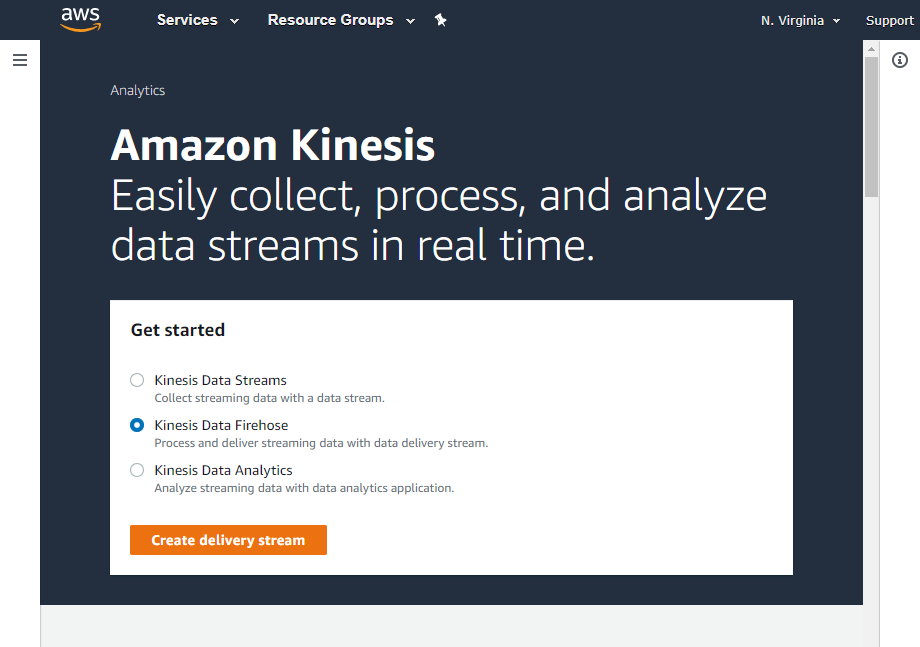
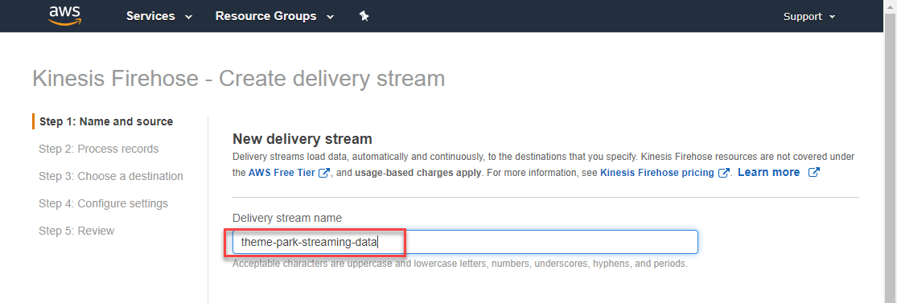
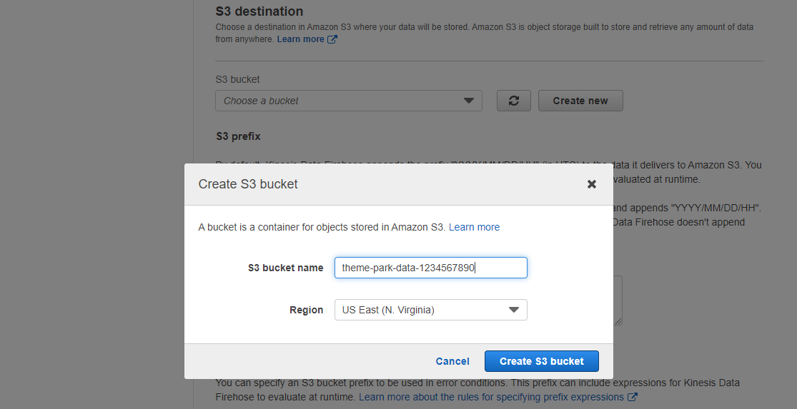
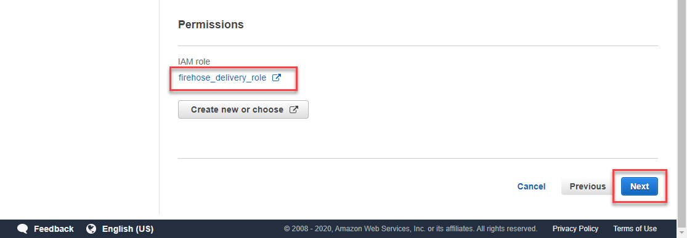
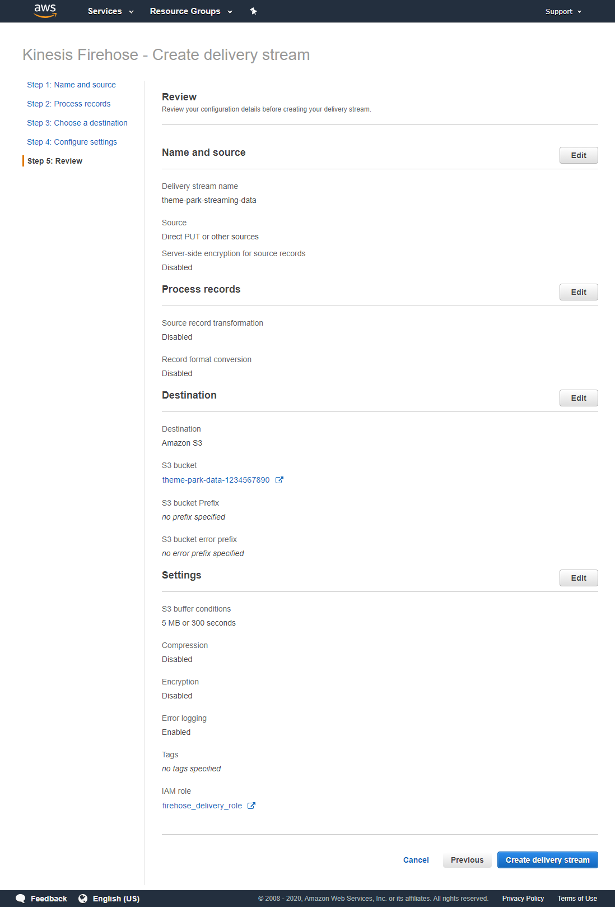
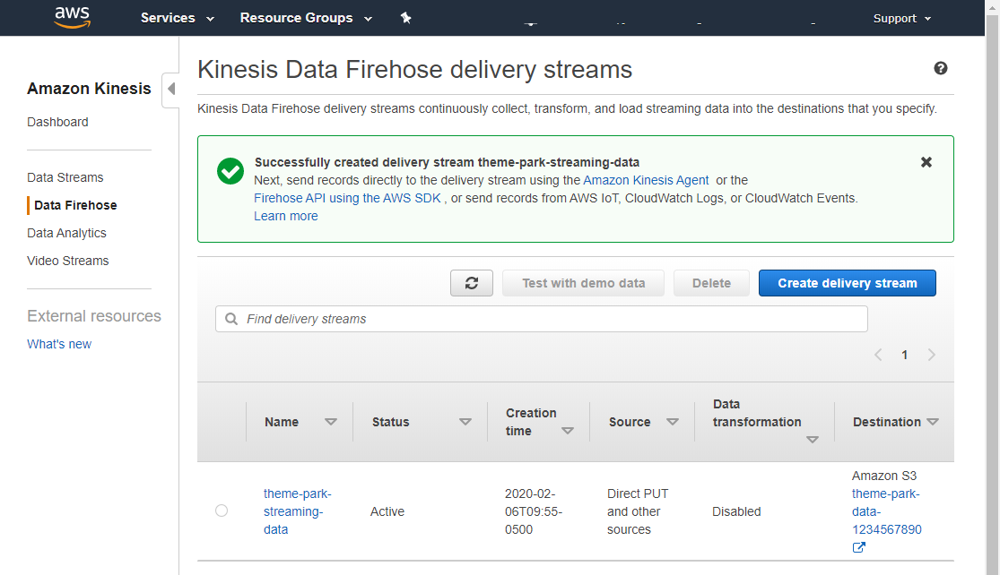

# Module 5: Analyzing visitor stats - (1) Configure Kinesis Firehose

*[Click here](../README.md) to return the main instructions for Module 5 at any time.*

Amazon Kinesis Data Firehose is a fully managed service that reliably loads streaming data into data lakes, data stores and analytics tools. It can capture, transform, and load streaming data into Amazon S3, Amazon Redshift, Amazon Elasticsearch Service, and Splunk, enabling near real-time analytics with existing business intelligence tools like Amazon QuickSight.

It automatically scales to match the throughput of your data and requires no ongoing administration. You can configure a delivery stream and start sending data from hundreds of thousands of data sources to be loaded continuously to AWS – all in just a few minutes. 

## Inside this section

This section shows how to set up and configure a Kinesis Firehose delivery stream. Once this is complete, you can send events to this stream and they will be stored in S3 for analysis.

*More information on the services introduced in this section:*
* [Amazon Kinesis Firehose](https://aws.amazon.com/kinesis/data-firehose/)

## Configure a Kinesis Firehose delivery stream

**:white_check_mark: Step-by-step Instructions**

1. Go to the AWS Management Console, click **Services** then select **Kinesis** under Analytics. **Make sure your region is correct.**

2. Choose **Get started**, then choose **Create delivery stream** in the Firehose panel.

3. For *Delivery stream name*, enter `theme-park-streaming-data`. Leave all the other defaults. Choose **Next**.

4. On the *Process records* page, leave the defaults and choose **Next**.

5. On the *Select a destination* page, in the *Destination* section leave *Amazon S3* selected. In the *S3 Destination* panel, choose **Create new**.

6. On the *Create S3 bucket* page:
- For *S3 bucket name* enter `theme-park-data-` followed by your AWS Account ID. 
- For *Region*, enter your current region.
- Choose *Create S3 bucket*.

**:star:You can find your AWS Account ID by clicking your name in the menu bar at the top of the page. If you can not find your AWS Account ID, you could also use a telephone number without any spaces or dashes.**

7. Back in the *Select a destination* page, choose **Next**.

8. On the *Configure settings* page, scroll down to the *Permissions* section. Choose **Create new or choose**. In the IAM window, choose **Allow**.

9. Back in the *Configure settings* page, note that the role name now appears, and then choose **Next**.

10. On the *Review page*, check your settings and then choose **Create delivery stream**.

11. Finally, on the *Kinesis Data Firehose delivery streams* page, wait until your new stream shows the status *Active*.

## Next steps

Next, you will deploy the simulator. To start the next section, [click here to continue](../2-simulator/README.md).

